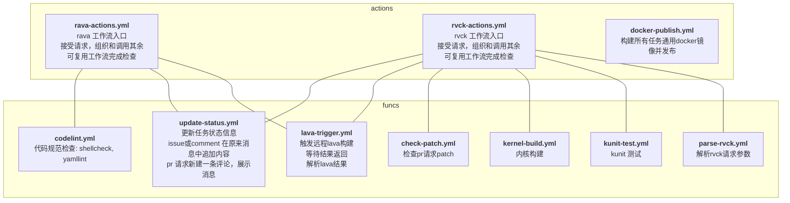
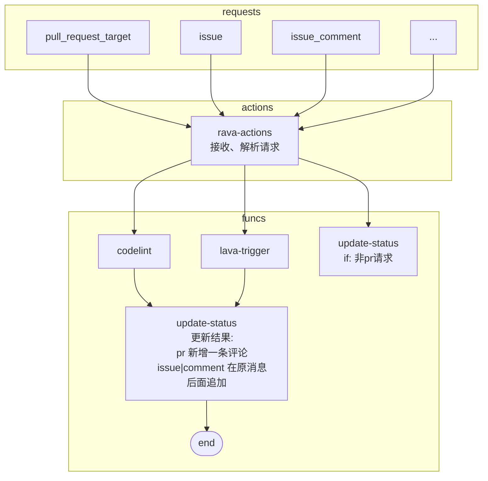
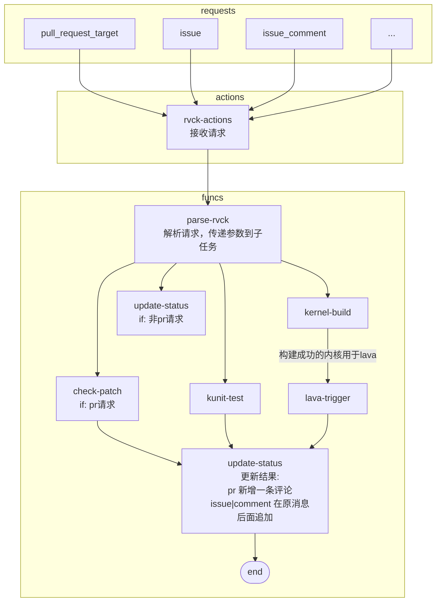
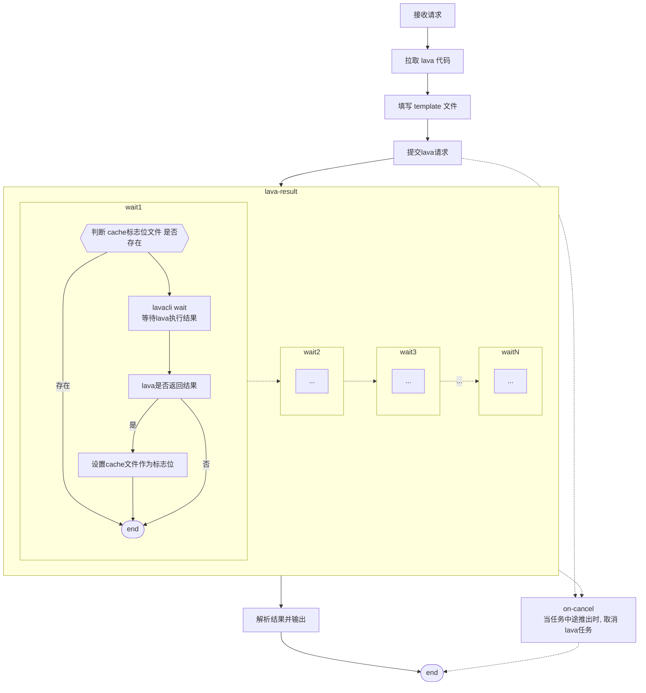

# OERV-RVCI workflow

## 工作流简介

工作流做简单分层

- `funcs` 为若干可复用工作流。传入指定参数后，即可执行，与具体仓库解耦
- `actions` 作为具体检查工作流入口(如`rvck, lava ...`), 负责解析请求任务，组织和调用`func`中可复用工作流完成检查。

## rava actions

## rvck actions

## 详细实现

### lava-trigger

