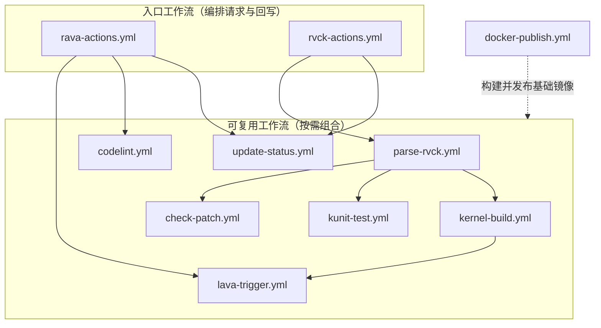
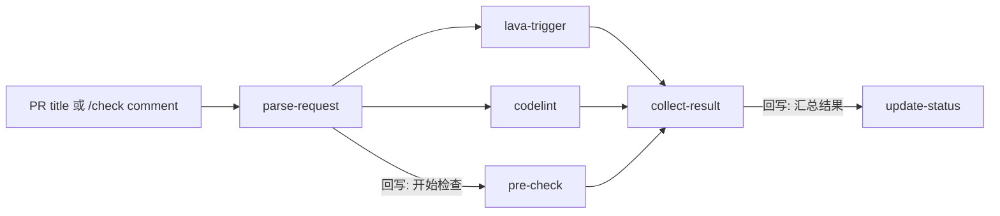
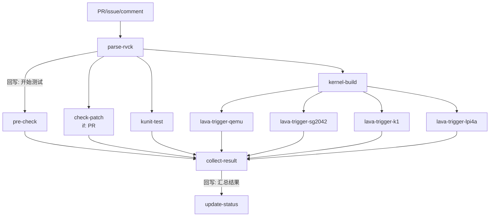
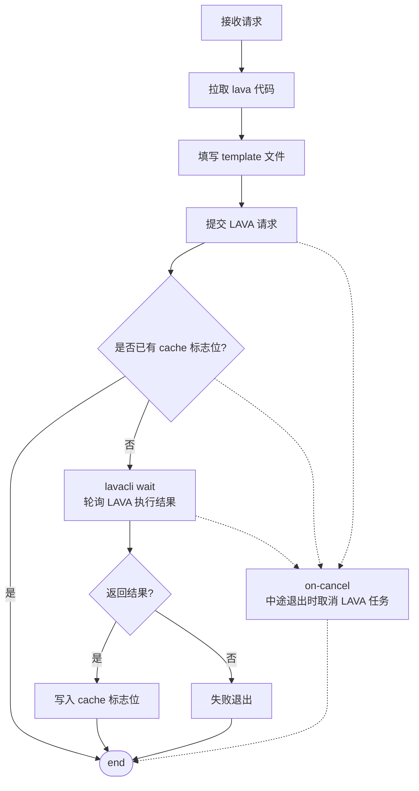

# OERV-RVCI / RVCK-RAVA

## 仓库简介

为 openEuler RISC-V (OERV) 内核与 LAVA 测试体系提供可复用的 GitHub Actions CI 流水线。
本仓库本身不直接响应 PR / issue，而是通过 `workflow_call` 被下游仓库的 CI 调用。

支持的下游项目：

- 内核仓库
  - [RVCK](https://github.com/RVCK-Project/rvck) — openEuler RISC-V 主线内核
  - [RVCK-OLK](https://github.com/RVCK-Project/rvck-olk) — openEuler 长期支持内核
- LAVA 测试仓库
  - [lavaci](https://github.com/RVCK-Project/lavaci) — LAVA jobs 与 testcases

## 目录结构

```text
.github/workflows/
├── rava-actions.yml     # 入口：LAVA 测试场景（由 lavaci 等仓库调用）
├── rvck-actions.yml     # 入口：内核测试全流程（由 rvck / rvck-olk 调用）
├── docker-publish.yml   # 公共 docker 镜像构建与发布（手动触发）
│
├── check-patch.yml      # 可复用：对 PR 提交跑内核 scripts/checkpatch.pl
├── codelint.yml         # 可复用：shellcheck + yamllint
├── kernel-build.yml     # 可复用：交叉编译内核并上传构建产物
├── kunit-test.yml       # 可复用：kunit 单元测试
├── lava-trigger.yml     # 可复用：提交 LAVA 任务并轮询结果
├── parse-rvck.yml       # 可复用：解析内核仓库请求参数
└── update-status.yml    # 可复用：回写任务状态到 issue / PR 评论
```

## 触发方式

两个入口工作流都通过 `workflow_call` 被下游仓库的 CI 在 `pull_request_target` / `issues` / `issue_comment` 事件上调用，**由不同的入口工作流解析不同格式的请求**：

| 入口工作流 | 下游仓库 | 事件 | 解析位置 | 请求格式 |
| - | - | - | - | - |
| `rava-actions` | LAVA 仓库（`lavaci`） | `pull_request_target` | PR **title** | `[lava_template]-[testcase_path]: desc` |
| `rava-actions` | LAVA 仓库（`lavaci`） | `issue_comment`（非 PR） | comment body | `/check lava_template=... testcase_path=...` |
| `rava-actions` | LAVA 仓库（`lavaci`） | `issue_comment`（PR 内） | body + title | body 需 `/check` 开头，同时按 title 解析模板与用例 |
| `rvck-actions` | 内核仓库（`rvck` / `rvck-olk`） | `pull_request_target` | PR **body** | body 留空或 `/check` 走默认测试集；`/check key=val` 覆盖 |
| `rvck-actions` | 内核仓库（`rvck` / `rvck-olk`） | `issues` | issue body | `/check fetch=<sha\|ref> [参数]`（无 `fetch` 时取仓库最新 commit） |
| `rvck-actions` | 内核仓库（`rvck` / `rvck-olk`） | `issue_comment` | comment body | `/check fetch=<sha\|ref> [参数]`（PR 内 comment 走 `pull/{id}/head`） |

`rvck-actions` 可识别的覆盖参数：

- `fetch=<sha|ref>` — 要测试的 commit / 分支（非 PR 场景必填）
- `job=<列表>` — 要执行的子任务，默认 `kunit-test,kernel-build,check-patch,lava-trigger`
- `lava_hardware=<列表>` — 目标硬件，默认取仓库变量 `RAVA_SUPPORT_DEVICE`
- `testcase_path=<路径>` — LAVA testcase 路径，默认 `lava-testcases/common-test/ltp/ltp.yaml`
- `ltp_testsuite=<类型>` — LTP 用例集合，默认 `math`

## 整体架构

工作流做两层拆分：

- **入口工作流**（`rava-actions.yml` / `rvck-actions.yml`）：负责解析请求、编排子任务、回写结果。
- **可复用工作流**：参数化、与具体仓库解耦，可被任一入口按需组合调用。


```mermaid
flowchart TB
    subgraph entry["入口工作流（编排请求与回写）"]
      rava["rava-actions.yml"]
      rvck["rvck-actions.yml"]
    end

    subgraph funcs["可复用工作流（按需组合）"]
      parse["parse-rvck.yml"]
      cpatch["check-patch.yml"]
      kunit["kunit-test.yml"]
      kbuild["kernel-build.yml"]
      lava["lava-trigger.yml"]
      lint["codelint.yml"]
      status["update-status.yml"]
    end

    docker["docker-publish.yml"] -.构建并发布基础镜像.-> funcs

    rvck --> parse
    parse --> cpatch
    parse --> kunit
    parse --> kbuild
    kbuild --> lava
    rvck --> status
    rava --> lava
    rava --> lint
    rava --> status
```

> 入口工作流内部分两步使用 `update-status`：`pre-check` 写入"开始测试"，`collect-result` 汇总结果。详细编排见后文「入口工作流」一节。

## 可复用工作流

| 工作流 | 作用 | 关键入参 / 出参 |
| - | - | - |
| `parse-rvck` | 解析内核仓库的请求参数 | 入：event payload；出：`REPO`、`FETCH_REF`、`SRC_REF`、`ISSUE_ID`、`COMMIT_URL`、`NEED_RUN_JOB`、`lava_hardware`、`ltp_testsuite`、`testcase_repo`、`testcase_path`、`lava_template_{qemu,sg2042,k1,lpi4a}` |
| `check-patch` | 抽取 PR 提交并跑内核 `scripts/checkpatch.pl` | 入：`kernel_src_repo`、`fetch_ref`、`src_ref` |
| `kunit-test` | 在内核源码上跑 kunit 单元测试 | 入：`kernel_src_repo`、`fetch_ref` |
| `kernel-build` | guix 镜像交叉编译内核，上传 kernel + initramfs + md5sum | 入：`commit_url`、`guix_image`；出：`kernel_files_url`、`kernel_md5sum`、`initramfs_md5sum` |
| `lava-trigger` | 提交 LAVA 任务并轮询结果，支持 cache 跨任务复用 | 入：`lava_template`、`testcase_path`、`kernel_files_url`、`max_wait_attempts` |
| `codelint` | 对指定路径跑 shellcheck + yamllint | 入：`repo`、`ref`、`check_path` |
| `update-status` | 统一回写：PR 新增评论，issue / comment 在原消息下追加 | 入：`repo`、`event_name`、`event_id`、`append_content` |

## 入口工作流

### rava-actions

由 LAVA 仓库（`lavaci` 等）调用，专注于模板 + testcase 验证，**不构建内核**，使用预置的 `rvck-olk/latest` 内核。


```mermaid
flowchart LR
  REQ[PR title 或 /check comment] --> PARSE[parse-request]
  PARSE -->|回写: 开始检查| PRE[pre-check]
  PARSE --> LAVA[lava-trigger]
  PARSE --> LINT[codelint]
  LAVA --> DONE[collect-result]
  LINT --> DONE
  PRE --> DONE
  DONE -->|回写: 汇总结果| END[update-status]
```

请求示例：

- PR title：`[lavaci/lava-job-templates/qemu/qemu.yaml]-[lavaci/lava-testcases/common-test/ltp/ltp.yaml]: desc`
- comment body：`/check lava_template=... testcase_path=...`

### rvck-actions

由内核仓库（`rvck` / `rvck-olk`）调用，覆盖内核检查全流程：patch 校验 → kunit → 内核构建 → 4 类硬件的 LAVA 任务。


```mermaid
flowchart TB
  REQ[PR/issue/comment] --> PARSE[parse-rvck]
  PARSE -->|回写: 开始测试| PRE[pre-check]
  PARSE --> CP[check-patch<br/>if: PR]
  PARSE --> KU[kunit-test]
  PARSE --> KB[kernel-build]
  KB --> LQ[lava-trigger-qemu]
  KB --> LS[lava-trigger-sg2042]
  KB --> LK[lava-trigger-k1]
  KB --> LL[lava-trigger-lpi4a]
  PRE --> DONE[collect-result]
  CP --> DONE[collect-result]
  KU --> DONE
  LQ --> DONE
  LS --> DONE
  LK --> DONE
  LL --> DONE
  DONE -->|回写: 汇总结果| END[update-status]
```

支持的硬件：`qemu`、`sg2042`、`sophgo k1`、`lichee pi 4a`，每个硬件对应一个 `lava-template-*` 输出，仅在有对应模板时触发。

## 详细实现

### lava-trigger


```mermaid
flowchart TB
  A[接收请求] --> B[拉取 lava 代码] --> C[填写 template 文件] --> D[提交 LAVA 请求]
  D --> JUDGE{是否已有 cache 标志位?}
  JUDGE --是--> E([end])
  JUDGE --否--> F["lavacli wait<br/>轮询 LAVA 执行结果"]
  F --> G{返回结果?}
  G --是--> H[写入 cache 标志位]
  G --否--> I[失败退出]
  H --> E
  I --> E

  D -.-> ONCANCEL[on-cancel<br/>中途退出时取消 LAVA 任务]
  JUDGE -.-> ONCANCEL
  F -.-> ONCANCEL
  ONCANCEL -.-> E
```

关键行为：

- **cache 复用**：`max_wait_attempts` 限制最长轮询轮数（每轮约 6h，rava 默认 40，rvck 默认 1）；轮询到 LAVA 任务结束（Complete / Canceled / Incomplete）后写 cache，后续任务命中 cache 时直接跳过等待，显著缩短长任务冷启动开销。
- **任务取消**：`on-cancel` 钩子在 workflow 任意阶段被取消时，主动调用 `lavacli cancel` 终止 LAVA 端的运行，避免资源泄漏。
- **内核来源**：rvck 场景下由 `kernel-build` 注入 `kernel_files_url` + md5sum；rava 场景下使用固定的 `rvck-olk/latest` 预置内核。

### update-status

- PR 场景（`pull_request` / `pull_request_target`）：在 PR 下新增一条评论。
- issue / issue_comment 场景：在原消息体下追加内容，便于保留历史上下文。
- 失败兜底：仅 `rava-actions` 的 `parse-request` 在 `onfailure` 步骤输出 `参数解析失败` 摘要，避免 parse 失败时 PR 完全无反馈。

## 使用示例

### 内核仓库（rvck / rvck-olk）

**PR 触发** —— PR body 留空或写 `/check` 都走默认测试集：

```text
/check
```

带参数覆盖（指定硬件、用例、子任务）：

```text
/check job=kunit-test,kernel-build lava_hardware=qemu,sg2042 testcase_path=lava-testcases/common-test/ltp/ltp.yaml
```

**Comment 触发** —— 必须带 `fetch=<sha|ref>` 指明要测试的代码：

```text
/check fetch=abc1234
/check fetch=v6.6 lava_hardware=qemu ltp_testsuite=math
```

**Issue 触发** —— 与 comment 类似，body 必须 `/check` 开头：

```text
/check fetch=main
```

### LAVA 仓库（lavaci）

**PR 触发** —— 通过 title 解析模板与用例：

```text
[lavaci/lava-job-templates/qemu/qemu.yaml]-[lavaci/lava-testcases/common-test/ltp/ltp.yaml]: test ltp on qemu
```

**Comment 触发** —— body 以 `/check` 开头带参数：

```text
/check lava_template=lavaci/lava-job-templates/qemu/qemu.yaml testcase_path=lavaci/lava-testcases/common-test/ltp/ltp.yaml
```
